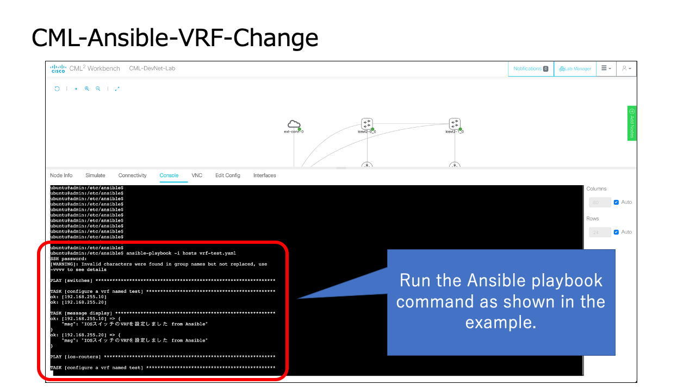
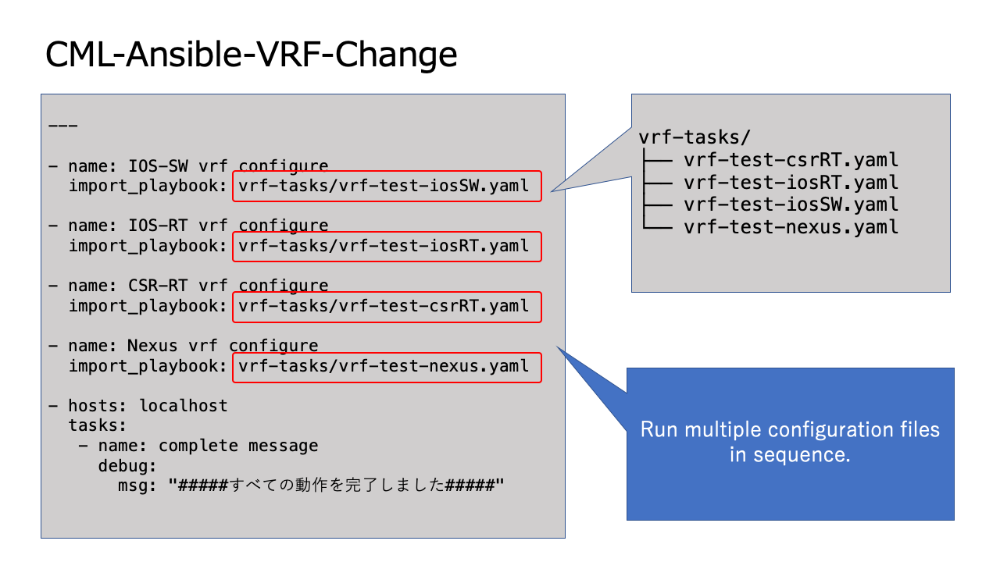

# CML-Ansible-VRF-Change

Problem: It is difficult for engineers to set up configurations for multiple models (e.g., VRF) because of the differences in the configuration system.

Solution: Use Ansible to configure VRF for multiple models at once. The verification is done on top of the CML lab. This time, the configuration file is divided into different models.

# How the script works

# Configration

